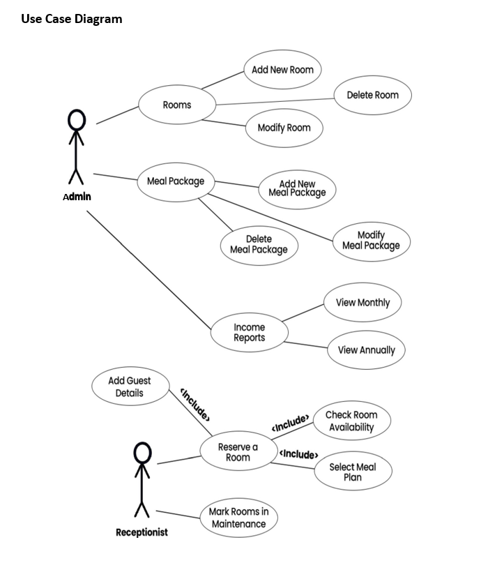

# Room-Reservation-System

Blue Ocean Hotel is a newly established hotel. This hotel is a medium-sized hotel with 25 rooms in total. This hotel includes single, double, triple and quad rooms. Additionally, they offer three meal plans, including local meals, Chinese meals and French meals. These meal plans can be requested while making room reservations.

## Objectives

Getting an approach to develop standalone applications using Java
- Usage of JavaFX for application development.
- Ability to create standard user interfaces for standalone applications.
- Usage of Event Handling.

## Built with

- Java
- JavaFX

## Roles

Following types of people accessing the system:
1. Admin
2. Receptionist

## Business Process

The following business process when a customer reserves a room from the system:

1. A customer can come to the hotel in person or contact the front desk over the phone for a reservation.

2. Once the customer inquires about rooms and packages, the receptionist provides them with the relevant details by referring to the system.

3. Once the customers make their pick, the receptionist will check the availability of the rooms and inform them. If the requested type is not available, the receptionist should find other
   suitable types and suggest them to the customer from the information in the system.

4. The following information will be requested from the customer when making a reservation:
   a. Name
   b. National Identity Card Number
   c. Telephone Number
   d. Email
   e. Address

5. If the customer makes a reservation for a night, the hotel room should be emptied by 11.00 am the next day.

6. If the customer books a room for a day or longer period, they should move out of the room by 9.00 am on the day after the requested period.

7. Cleaners of the room will take one hour to clean a room after a customer moves out, so the rooms will not be available for reservation until the cleaning ends.

8. Additionally, the receptionist will be informed if a particular room is under maintenance. Thus, the receptionist marks that room under maintenance, and it will not be displayed in the
   "available rooms" view.

9. The receptionist can cancel a specific reservation if the customer requests it.

10. The receptionist can view the details of the customers if necessary.

11. The hotel manager has access to the admin account, and he/she can add rooms, meal plans and, if necessary, edit them.

12. The manager also can edit the prices of the given packages.

13. The manager gets an income report to be viewed freely according to the records in the system.



```
Administrator

username : admin
password : 1234

Receptionist

username : receptionist
password : 2345
```

## LICENSE

See the [LICENSE](LICENSE) for more information.


